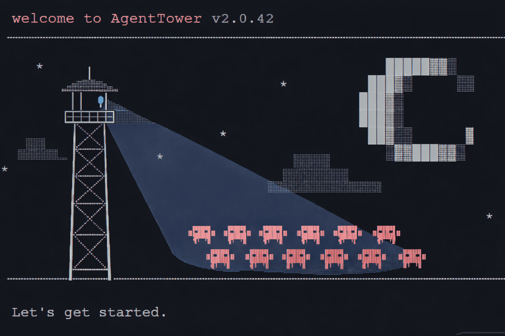

<div align="center">
  
  <h1>AgentTower</h1>
  <p>A real-time web UI for monitoring, searching, and controlling Claude Code sessions</p>
  
  <br/><br/>
</div>

> **For AI agents:** See [`AGENTS.md`](./AGENTS.md) — it has a fully automated setup script that requires only a password from the user.

---

## Quick start

```bash
git clone https://github.com/Ar9av/AgentTower && cd AgentTower
echo "AUTH_PASSWORD=yourpassword" > .env.local
npm install && npm run dev
```

Open **http://localhost:3000** — sign in with the password you set. That's it.

---

## What it does

### Session viewer
- **Full conversation rendering** — user messages, Claude responses, tool calls, tool results, thinking blocks
- **Inline diff viewer** — `Edit` and `MultiEdit` tool calls render as a real red/green unified diff
- **Terminal-style Bash** — `Bash` tool calls show the command with a `$` prompt and scrollable output
- **Markdown tables** — tables in Claude's responses render as proper HTML tables
- **Copy buttons** — copy any code block or message text with one click
- **Live tail** — new messages appear in real time via SSE while Claude is running
- **Deep-link to message** — search results jump straight to the matching message in context
- **In-session filter** — type in the session header to filter messages by text
- **Export to Markdown** — download the full conversation as a `.md` file

### Session control
- **Send input** — inject a new message into any running or finished session
- **Fork from any message** — create a copy of the conversation up to any point and branch from there
- **Kill / Pause / Resume** — full process control with confirmation
- **Stop & resend** — kill the current task and immediately start a new one

### Global search
- **Cross-session search** — grep across every session file with live results
- **Regex mode** — toggle `.*` for full regex patterns
- **Filter by project** — narrow results to a single project
- **Sort** by newest, oldest, or most hits

### Agent Tower (visual monitor)
- **Office scene** — pixel-art building with agents placed on floors by status: working → Office, done → Boardroom, idle → Lounge
- **Live state** — agents animate between idle / working / done / signaling as sessions change
- **Lift car** — animates between floors whenever an agent changes status
- **Click any agent** — inspect messages and send input without leaving the Tower
- **Dispatch task** — spawn a new Claude agent from the Commander button
- **Dark + light mode** — night sky in dark mode, warm sky in light mode

### Projects & navigation
- **Projects grid** — all projects at a glance, active ones highlighted with a pulsing dot
- **Session list** — Active / History split per project with message counts and cost estimates
- **Git branch badge** — shows which branch each session ran on
- **Cmd+K** — focus the global search from anywhere

### Daily Brief
- Scheduled morning summaries delivered to **Telegram**
- Per-project task types: code improvements, bug fixes, docs, Obsidian notes
- Output formats: GitHub PR, PDF, Telegram message, text summary
- Manual trigger + brief history

---

## Prerequisites

- **Node.js 18+** — `node --version`
- **npm 9+** — `npm --version`
- **Claude Code** — sessions must exist at `~/.claude/projects/`

---

## Configuration

All config via `.env.local` (gitignored).

| Variable | Required | Default | Description |
|---|---|---|---|
| `AUTH_PASSWORD` | **Yes** | — | Login password |
| `CLAUDE_DIR` | No | `~/.claude` | Claude config root |
| `SESSION_TTL_DAYS` | No | `7` | Cookie lifetime in days |
| `ACTIVE_THRESHOLD_SECS` | No | `300` | Seconds window for "active" badge |
| `NEXT_PUBLIC_BASE_PATH` | No | — | Sub-path deployment, e.g. `/agents` |

### Minimal `.env.local`

```env
AUTH_PASSWORD=my-secure-password
```

### Sub-path deployment (e.g. behind a reverse proxy at `/agents`)

```env
AUTH_PASSWORD=my-secure-password
NEXT_PUBLIC_BASE_PATH=/agents
```

---

## Running

```bash
# Development (hot reload)
npm run dev

# Production
npm run build && npm start

# Custom port
PORT=8484 npm start
```

### Persistent server (Linux / remote machine)

```bash
npm run build
npm install -g pm2
pm2 start "npm start" --name agenttower
pm2 save
```

### Behind a reverse proxy (Apache / nginx)

For nginx, proxy `location /agents/` to `http://localhost:3000` and set `NEXT_PUBLIC_BASE_PATH=/agents` in `.env.local`.

For Apache:

```apache
<Location /agents/>
  ProxyPass        http://localhost:3000/agents/
  ProxyPassReverse http://localhost:3000/agents/
</Location>
```

---

## Project structure

```
agenttower/
├── app/
│   ├── api/                    REST + SSE endpoints
│   │   ├── auth/               login / logout
│   │   ├── projects/           list projects
│   │   ├── sessions/           list sessions per project
│   │   ├── session/            parse JSONL (paginated, supports ?around=<uuid>)
│   │   ├── tail/               SSE live stream
│   │   ├── search/             cross-session grep
│   │   ├── fork/               copy session up to a message UUID
│   │   ├── run/                spawn new Claude process
│   │   ├── input/              send message to running session
│   │   ├── kill / pause /      process signals
│   │   │   resume/
│   │   ├── recent-sessions/    last N sessions across all projects
│   │   ├── upload-image/       image attachment support
│   │   └── daily-brief/        brief config, history, trigger
│   ├── login/                  login page
│   ├── projects/               projects grid
│   ├── project/                sessions for one project
│   ├── session/                full session reader
│   ├── search/                 global search
│   ├── tower/                  Agent Tower visual monitor
│   ├── daily-brief/            daily brief config + history
│   └── integrations/           Telegram + Antigravity settings
├── components/
│   ├── MessageBlock.tsx         renders all message/tool block types
│   ├── LiveSession.tsx          SSE client, auto-scroll, input, fork
│   ├── TowerView.tsx            pixel-art office scene + agent sprites
│   ├── Nav.tsx                  sticky nav with Cmd+K search
│   └── ...
├── lib/
│   ├── auth.ts                  PBKDF2 hashing, rate limiting, cookies
│   ├── claude-fs.ts             JSONL parser, project discovery, search, SSE
│   ├── types.ts                 shared TypeScript types
│   └── world-engine/            tile-map renderer for the Tower scene
├── public/sprites/              agent + building sprite sheets
├── AGENTS.md                    automated setup guide for AI agents
└── SETUP.md                     step-by-step human setup guide
```

---

## How the data works

Claude Code writes session logs to `~/.claude/projects/<encoded-path>/<session-id>.jsonl`. Each line is a JSON object (user message, assistant response, tool call, etc.).

AgentTower:
1. Walks `~/.claude/projects/` to discover all projects and sessions
2. Parses JSONL files into typed `ParsedMessage` objects (cached by `path + mtime`)
3. Reads `~/.claude/sessions/<pid>.json` to detect running processes
4. Streams new lines via SSE by tracking file byte offsets

---

## Security

- Passwords hashed with **PBKDF2-HMAC-SHA256** (260k iterations + random salt). Plaintext never stored.
- **Exponential backoff** on failed logins: 2s → 4s → 8s → … capped at 1 hour per IP.
- **HttpOnly + SameSite=Strict** cookies.
- All API routes require a valid session cookie.
- File paths validated against `CLAUDE_DIR` before reading (no path traversal).
- Process signals verify the target PID is a `claude` process owned by the current user.

**For remote/production access:**
- Put behind HTTPS (Caddy, nginx + Let's Encrypt, or Cloudflare)
- Use a long random `AUTH_PASSWORD` (32+ chars)
- Consider Tailscale or Cloudflare Access for an extra auth layer

---

## Troubleshooting

| Symptom | Fix |
|---|---|
| `AUTH_PASSWORD is not set` | Create `.env.local` with `AUTH_PASSWORD=yourpassword` |
| No projects showing | Check `~/.claude/projects/` exists and has `.jsonl` files |
| Live tail not updating | Check browser console for SSE errors; reload the page |
| `EADDRINUSE` on port 3000 | `PORT=8484 npm start` |
| Can't log in | No spaces or quotes around the password value in `.env.local` |
| Tower shows no agents | Sessions must exist — run a Claude Code session first |
